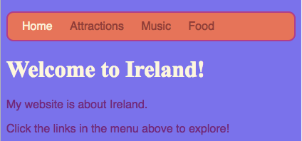
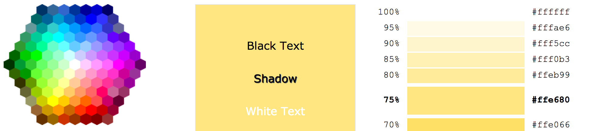

## All the colours!

As you have seen before, you can type in many different colour names as words, and the browser will recognise them. But a more common way to set colours is to use something called **hex codes** ('hex' is short for **hexadecimal**, a special way of counting).

+ Take a look at your **style sheet**. That's the file that has `.css` in the name.

+ Inside the CSS rules for `body`, set the background colour to the hex code `#7B68EE`:

```html
  background-color: #7B68EE;
```

Note: If you are using a Mac, you can type `#` by press the <kbd>alt</kbd> and the <kbd>3</kbd> keys at the same time.

Your website should now have a purple background. 

 



+ Not a fan of purple? Go to [this web page](http://dojo.soy/se-html2-colours){:target="_blank"} and choose another colour for your style sheet — instead of typing the name of the colour, type in the hex code. 


Colour codes allow you to create any colour, even if it's not on any list of colour names. 

+ Try making up your own colour code. It must start with a `#`. This tells the browser that it is a hex code instead of a colour name. The rest of the code is made up of six characters. They can be  any number from **0 to 9** and any letter from **A to F**.

--- collapse ---
---
title: How does it work? 
---

Every colour is made by mixing different amounts of **red**, **green**, and **blue**. You will sometimes see this written down as **RGB**. Each of these colours is represented by two of the six digits in your HEX code. `00` is the minimum, and `FF` is the maximum.

**Hexadecimal** is a way of counting that makes numbers shorter to write by using the letters A-F as extra digits. The number `255` is written as `FF` in hexadecimal. You don't need to worry about learning to count with hexadecimal numbers. Instead, experiment with different hex codes to get used to using them.

* Here are some basic colours to try out on your website. Try putting in smaller numbers instead of `FF` to see how the shades change.

|   |R |G |B  | Result     |
|---|--|--|---|:----------:|
| \#|FF|00|00 | Red        |
| \#|00|FF|00 | Green      |
| \#|00|00|FF | Blue       |
| \#|FF|FF|00 | Yellow     |
| \#|FF|00|FF | Magenta    |
| \#|00|FF|FF | Cyan       |
| \#|FF|8c|00 | Dark orange |

--- /collapse ---

Mixing the perfect colour can take a lot of experimenting. Luckily, there are plenty of online colour picking tools that help you get the hex code for any colour you want. 



+ Try out [this colour picker](http://dojo.soy/se-html2-picker){:target="_blank"} to choose some hex colour codes to use for the rest of the styles on your website.
