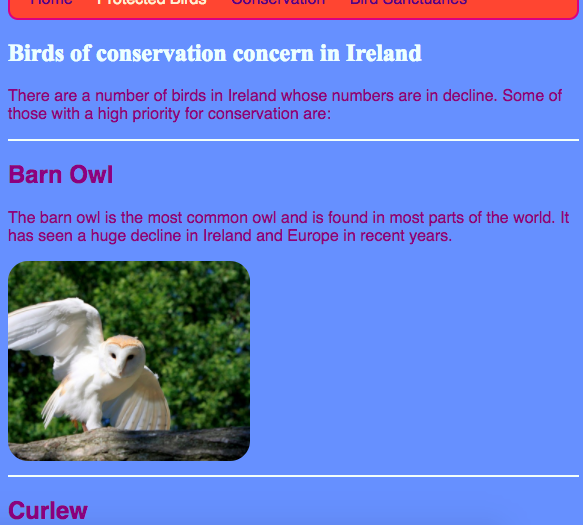
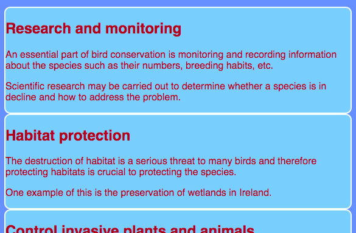

## Design some themes

Writing CSS rules for elements such as `section` and `p` is great, but what if you want to make some of them look different from others? On this card you will learn how to apply different sets of style rules to elements of the same type and create a different theme for each page on your website!

+ Go to your style sheet file and add the following — be sure to include the dot in front!
  
```css
  .topDivider {
    border-top-style: solid;
    border-top-width: 2px;
    border-top-color: #F5FFFA;
    padding-bottom: 10px;
  }
```

+ Now go to `birds.html` (or the HTML file you're working on if you're using your own project), and add the following **attribute** to each `section` tag:

```html
  <section class="topDivider">
```

You should see a line appear above each section on the page. Congratulations — you've just used your first **CSS class**!



+ Look at how your web page looks now and compare it to the other pages that have `section` elements. You'll see that only the ones where you added the attribute `class="topDivider"` will have the line on top.

--- collapse ---
---
title: How does it work?
---

Remember that when you use a CSS **selector** such as `section` or `p` or `nav ul`, the style rules apply to **all** the elements of that type on your website.

With CSS **classes**, you're able to change the style of just **some** of the elements. 

Putting a dot in front of your selector makes it into a **class selector**. A class can have any name, so it doesn't have to be the name of a HTML element. For example:

```css
  .myAwesomeClass {
    /* my cool style rules go here */
  }
```

To choose which elements the style rules apply to, you add the `class` **attribute** to those elements in the HTML code: put the name of the class in as the value for the attribute, **without** the dot, like this:

```html
  class="myAwesomeClass"
```

--- /collapse ---

 + Ready to try another class? Add the following CSS code to `styles.css`:

```css
  .stylishBox {
    background-color: #87CEFA;
    color: #A52A2A;
    border-style: solid;
    border-width: 2px;
    border-color: #F5FFFA;
    border-radius: 10px;
  }
```

+ Then, on a different page of your website, add the class to some elements there. I'm going to add it to the `section` elements on the Conservation page of my website, like this: `<section class="stylishBox">`.

It looks great, but now my sections are all squashed together.



You can apply as many CSS classes to an element as you like. Just write the names of all the classes you want to use inside the `class` attribute (remember, without the dot!), separating them with spaces.

+ Let's make another CSS class to give the sections some margin and padding. In the `styles.css` file, create the following CSS class:

```css
  .someSpacing {
    padding: 10px;
    margin-top: 20px;
  }
```

+ In your `html` code, add the new class to each of the elements you were working on, like this:

```html
  <section class="stylishBox someSpacing">
```


So CSS classes let you **choose** which elements to style, and they let you **reuse** the same set of style rules on any elements you want.

+ Go to `index.html` and add the `stylishBox` class to the `main` element, or another element on the page. You can remove it again afterwards!

```html
    <main class="stylishBox">	
```

Here's what my home page looks like with the CSS class. I've also added the `topDivider` and `someSpacing` classses to the `img` tag with the picture of the barn owl.


--- challenge ---

## Challenge: make some new classes

+ Use CSS **classes** to define a few different picture sizes for your website, for example `.smallPictures` and `.mediumPictures`. Then remove the `width` attribute from each of your `img` elements and add the appropriate class instead.

--- hints ---

--- hint ---

You can make a CSS class that defines just the width of an element like this:

```css
  .smallPictures {
    width: 100px;
  }
```

--- /hint ---

--- hint ---

Here's an `img` tag with a `width` attribute:

```html
    		
```

When you remove the `width` attribute and control the size with the CSS class instead, it looks like this:

```html
    		
```

By using a CSS class, you can easily change the width of all the pictures at once by changing only one line of code in your style sheet!

--- /hint ---

--- /hints ---

--- /challenge ---
