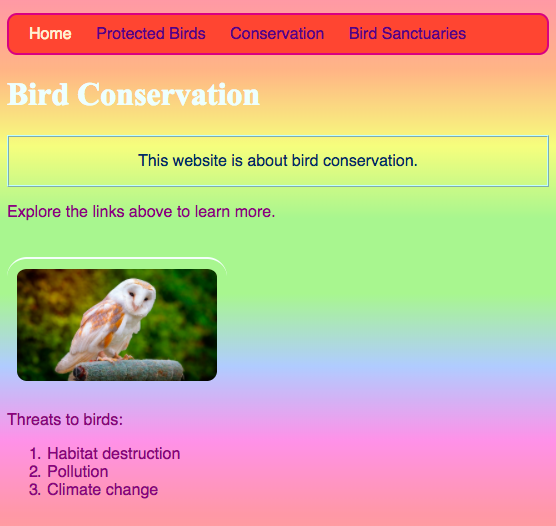

## Individual style

 Let's jazz up the home page a bit! With another kind of CSS selector, you can apply a unique set of CSS rules to just **one specific element**.
 
+ Go to `index.html` and find a paragraph (`p`) element, or add one in if you don't have any. Add the following **attribute** to the tag:

```html
    <p id="myCoolText">
        My website is about Ireland.
    </p> 
```

The `id` is a name you give a particular element to **identify** it. No two elements on a page should ever have the same `id`!

+ Now go to your style sheet and add the following code:

```css
    #myCoolText {
        color: #003366;
        border: 2px ridge #ccffff;
        padding: 15px;
        text-align: center;
    }
```

Your text should look like this now:


A selector with a `#` in front of it is used to apply CSS rules to one specific element on your website. You specify the element with the help of the name that you assigned the element's `id` attribute.

+ Let's do one for the `body` of the home page. Go to `index.html` and add an `id` to the `body` tag.

```html
    <body id="frontPage">
```

+ In the style sheet, add the following CSS rules:

```css
    #frontPage {
        background: #48D1CC;
        background: linear-gradient(#fea3aa, #f8b88b, #faf884, #baed91, #baed91, #b2cefe, #f2a2e8, #fea3aa);
    }
```

You should get something that looks like this:


    
You just used a **gradient**! That's the name given to the effect where one colour fades into another. Note: The first `background` property above the gradient one determines a default colour for browsers that don't support gradients.

If you typed the code perfectly and you didn't get the lovely rainbow effect above, it could be that your browser doesn't support gradients.

You can make lots of different effects with gradients. If you want to learn more, go [here](http://dojo.soy/html2-css-gradients){:target="_blank"}.


--- challenge ---

## Challenge: style some more elements

+ Try giving another element an `id` and styling that element using the ID selector with a `#` as above. How about making one picture have a `border-radius` of `100%` so that it's fully rounded? Any other pictures on the website will stay the same as they are. 

--- hints ---

--- hint ---

You give an element an `id` by adding the `id` attribute to the HTML tag, like this:

```html
    		
```

Choose any `id` name you like.

--- /hint ---

--- hint ---

To define style rules for a specific element, you use the `#` symbol, and the name that you gave the element as its `id`.

```css
  #titoPicture {
    border-radius: 100%;
  }
```

Note: the name you type in front of the CSS rules should **exactly** match the name you put in the element's `id` attribute.

--- /hint ---

--- /hints ---


--- /challenge ---

