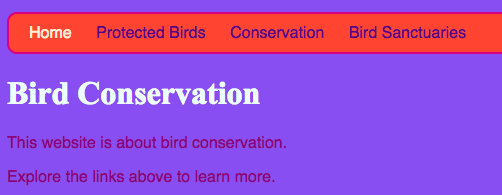

## सभी रंग!

जैसा कि आपने पहले देखा है, आप शब्दों के रूप में कई अलग-अलग रंगों के नाम टाइप कर सकते हैं, और ब्राउज़र उन्हें पहचान लेगा। लेकिन रंगों को सेट करने का एक सामान्य तरीका है **हेक्स कोड** का उपयोग करना ('हेक्स', **हेक्साडेसिमल** का संक्षिप्त रूप, गिनती का एक विशेष तरीका है)।

+ अपने ** स्टाइल शीट (style sheet) ** पर एक नज़र डालें। यह वह फ़ाइल है जिसके नाम में `.css` है ।

+ `body` के लिए CSS नियमों के अंदर, पृष्ठभूमि के रंग को हेक्स कोड `#7B68EE` पर सेट करें।

```html
  background-color: #7B68EE;
```

नोट: यदि आप एक Mac का उपयोग कर रहे हैं, तो आप <kbd>alt</kbd> और <kbd>3</kbd> को एक साथ दबा कर `#` टाइप कर सकते हैं ।

आपकी वेबसाइट पर अब बैंगनी पृष्ठभूमि होनी चाहिए.

 


+ बैंगनी के प्रशंसक नहीं? [इस वेब पृष्ठ](http://dojo.soy/se-html2-colours){:target="_blank"} पर जाएं और अपनी स्टाइल शीट (style sheet) के लिए कोई रंग चुनें - रंग का नाम टाइप करने के बजाए, हेक्स कोड टाइप करें।


रंग कोड आपको कोई भी रंग बनाने की अनुमति देते हैं, भले ही वह किसी भी रंग के नामों की सूची में न हो।

+ अपना स्वयं का रंग कोड बनाने का प्रयास करें। इसकी शुरुआत `#` से होनी चाहिए। यह ब्राउज़र को बताता है कि यह रंग के नाम के बजाय एक हेक्स कोड (hex code) है। बाकी का कोड छह अक्षरों से बना है। वे **0 से 9** तक कोई भी संख्या हो सकती है और **A से F** तक कोई भी अक्षर।

--- collapse ---
---
title: यह कैसे काम करता है?
---

हर रंग **लाल**, **हरे** और **नीले** की विभिन्न मात्राओं को मिलाकर बनाया जाता है । आप कभी-कभी इसे **RGB** लिखा देखेंगे । इनमें से प्रत्येक रंग आपके HEX कोड में छह अंकों में से दो के द्वारा दर्शाया जाता है। `00` न्यूनतम है, और `FF` अधिकतम है।

**हेक्साडेसिमल** गिनती का एक तरीका है जो A-F अक्षरों को अतिरिक्त अंकों के रूप में लिखकर संख्याओं को छोटा बनाता है। हेक्साडेसिमल में, संख्या `255` `FF` के रूप में लिखा गया है । आपको हेक्साडेसिमल संख्याओं को सीखने के बारे में चिंता करने की आवश्यकता नहीं है। इसके बजाय, विभिन्न हेक्स कोड के साथ प्रयोग करके उन्हें उपयोग करने का प्रयास करें ।

* यहाँ आपकी वेबसाइट पर आज़माने के लिए कुछ बुनियादी रंग हैं। `FF` के बजाय छोटी संख्या डालने का प्रयास करें, यह देखने के लिए कि शेड कैसे बदलते हैं।

|      | R  | G  | B  |   परिणाम    |
| ---- | -- | -- | -- |:-----------:|
| \ # | FF | 00 | 00 |     लाल     |
| \ # | 00 | FF | 00 |     हरा     |
| \ # | 00 | 00 | FF |    नीला     |
| \ # | FF | FF | 00 |    पीला     |
| \ # | FF | 00 | FF |   मैजेंटा   |
| \ # | 00 | FF | FF |    सियान    |
| \ # | FF | 8c | 00 | गहरा नारंगी |

--- /collapse ---

सही रंग मिलाने के लिए बहुत सारे प्रयोग करने पड़ेंगे। सौभाग्य से, ऑनलाइन रंग भरने वाले बहुत सारे उपकरण हैं जो आपको किसी भी रंग के लिए हेक्स कोड प्राप्त करने में मदद करते हैं।


+ अपनी वेबसाइट पर बाकी स्टाइल्स के लिए उपयोग करने के लिए कुछ हेक्स(HEX) रंग कोड चुनने के लिए [इस रंग बीनने](http://dojo.soy/se-html2-picker){:target="_blank"} का उपयोग करें।
