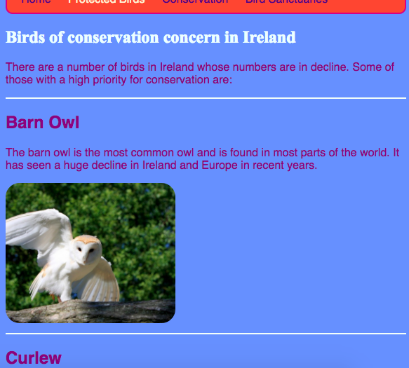
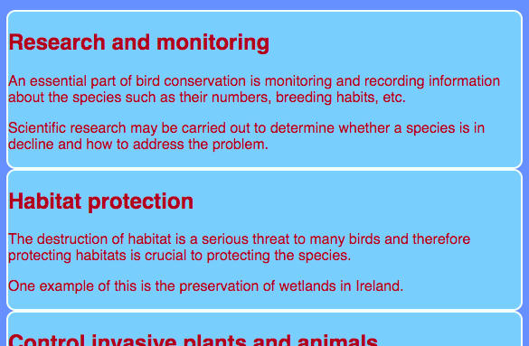
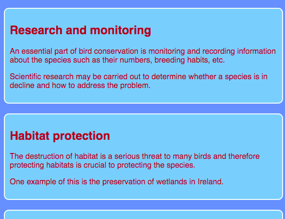
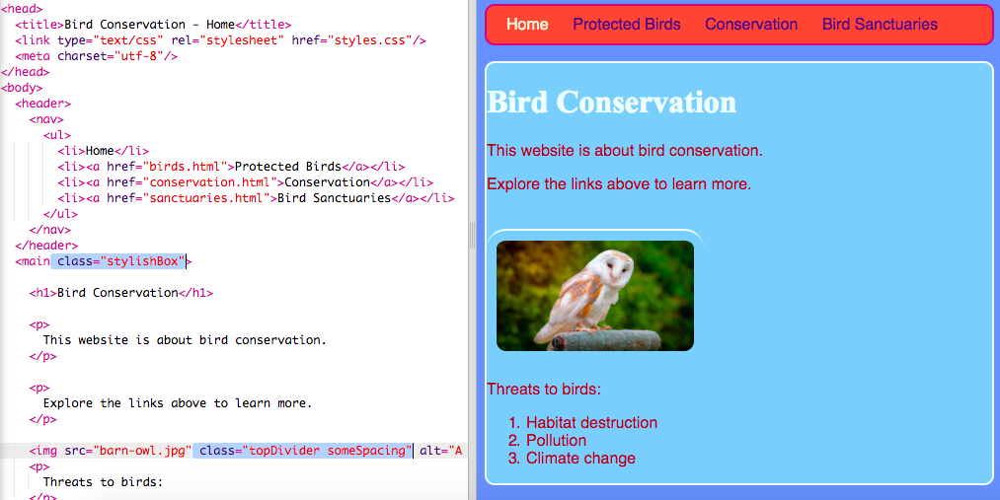

## कुछ थीम डिजाइन करें

`section` और `p` जैसे एलीमेंट्स के लिए CSS नियम लिखना आसान है, लेकिन क्या होगा अगर आप उनमें से कुछ को दूसरों से अलग दिखना चाहते हैं? इस कार्ड पर आप सीखेंगे कि एक ही प्रकार के एलीमेंट्स के लिए स्टाइल नियमों के विभिन्न सेट कैसे लागू करें और अपनी वेबसाइट पर प्रत्येक पृष्ठ के लिए एक अलग थीम बनाएं!

+ अपनी स्टाइल शीट(style sheet) फ़ाइल पर जाएं और निम्नलिखित जोड़ें - सामने डॉट को शामिल करना सुनिश्चित करें!

```css
  .topDivider {
    border-top-style: solid;
    border-top-width: 2px;
    border-top-color: #F5FFFA;
    padding-bottom: 10px;
  }
```

+ अब `birds.html` पर जाएं (या यदि आप अपनी स्वयं की परियोजना का उपयोग कर रहे हैं तो उस HTML फ़ाइल पर जाएं जिस पर आप काम कर रहे हैं), और निम्नलिखित **attributes** प्रत्येक `section` टैग के लिए जोड़ें:

```html
  <section class="topDivider">
```

आपको पृष्ठ पर प्रत्येक अनुभाग के ऊपर एक पंक्ति दिखाई देनी चाहिए। बधाई - आपने अपनी पहली **CSS class** का उपयोग किया है!



+ देखें कि आपका वेब पृष्ठ अब कैसा दिखता है और इसकी तुलना उन अन्य पृष्ठों से करें जिनके पास `section` एलीमेंट है। आप देखेंगे कि केवल वहीं शीर्ष पर लाइन होगी जहाँ आपने `class="topDivider"` एट्रिब्यूट जोड़ा था।

--- collapse ---
---
title: यह कैसे काम करता है?
---

याद रखें कि जब आप CSS **selector** का उपयोग करते हैं जैसे `section` या `p` या `nav ul`, आपकी वेबसाइट पर वो स्टाइल नियम उस प्रकार के **सभी** एलीमेंट पर लागू होते हैं।

CSS **classes** के साथ, आप बस **कुछ** एलीमेंट्स के स्टाइल को बदलने में सक्षम हैं।

अपने selector के सामने बिंदी लगाने से यह **class selector** में बदल जाता है। एक class का कोई भी नाम हो सकता है, इसलिए उसे HTML एलीमेंट का नाम होना जरुरी नहीं है । उदाहरण के लिए:

```css
  .myAwesomeClass {
    /* my cool style rules go here */
  }
```

यह चुनने के लिए कि स्टाइल के नियम किन एलीमेंट्स पर लागू होते हैं, आप HTML कोड में उन तत्वों के लिए `class` **attribute** जोड़ते हैं: एट्रिब्यूट के मान के रूप में क्लास का नाम डालें, **बिना** बिंदु, इस तरह:

```html
  class="myAwesomeClass"
```

--- /collapse ---

 + एक और क्लास इस्तेमाल करने के लिए तैयार हैं? निम्नलिखित CSS कोड को `styles.css` में जोड़ें:

```css
  .stylishBox {
    background-color: #87CEFA;
    color: #A52A2A;
    border-style: solid;
    border-width: 2px;
    border-color: #F5FFFA;
    border-radius: 10px;
  }
```

+ फिर, अपनी वेबसाइट के एक अलग पृष्ठ पर, वहाँ कुछ एलीमेंट्स के लिए क्लास जोड़ें। मैं इसे अपनी वेबसाइट के संरक्षण पृष्ठ पर `section` एलीमेंट्स जोड़ने में जा रहा हूँ, जैसे: `<section class="stylishBox">`।

यह बहुत अच्छा लग रहा है, लेकिन अब मेरे अनुभागों को एक साथ जोड़ दिया गया है।



आप जितने चाहें उतने CSS क्लासेस को एक एलीमेंट पर लगा सकते हैं। बस उन सभी क्लासेस के नाम रिक्त स्थान के साथ अलग अलग करके लिखें जिन्हें आप `class` एट्रिब्यूट के अंदर उपयोग करना चाहते हैं (याद रखें, बिंदु के बिना!)

+ चलिए अनुभागों को कुछ मार्जिन और पैडिंग देने के लिए एक और CSS क्लास बनाते हैं। `styles.css` फ़ाइल में, निमलिखित CSS क्लास बनाएँ:

```css
  .someSpacing {
    padding: 10px;
    margin-top: 20px;
  }
```

+ अपने `html` कोड में, इस तरह से काम कर रहे एलीमेंट्स में से प्रत्येक में नई क्लास जोड़ें:

```html
  <section class="stylishBox someSpacing">
```



तो CSS क्लासेस आपको **चुनने** देते हैं कौन से एलीमेंट्स को स्टाइल करना है, और आप उन्हीं स्टाइल नियमों को आपकी मर्ज़ी के एलीमेंट्स पर **दोबारा उपयोग** कर सकते हैं।

+ `index.html` पर जाएँ और `stylishBox` क्लास को `main` एलीमेंट या पृष्ठ पर किसी और एलीमेंट से जोड़ें। आप इसे बाद में फिर से हटा सकते हैं!

```html
    <main class="stylishBox">   
```

मेरा मुख पृष्ठ CSS क्लास के साथ ऐसा दिखता है। मैंने खलिहान उल्लू की तस्वीर वाले `img` टैग में `topDivider` और `someSpacing` क्लासेस भी जोड़े हैं।



--- challenge ---

## चुनौती: कुछ नई क्लासेस बनाएं

+ CSS **classes** का उपयोग करें अपनी वेबसाइट के लिए कुछ अलग चित्र आकारों को परिभाषित करने के लिए, उदाहरण के लिए `.smallPictures` और `.mediumPictures`। फिर अपने प्रत्येक `img` एलीमेंट से `width` एट्रिब्यूट निकालें और इसके बजाय उपयुक्त क्लास जोड़ें।

--- hints ---


--- hint ---

आप एक CSS क्लास बना सकते हैं जो इस तरह से किसी एलीमेंट की चौड़ाई को परिभाषित करता है:

```css
  .smallPictures {
    width: 100px;
  }
```

--- /hint ---

--- hint ---

यहाँ एक `img` टैग है `width` attribute के साथ:

```html
           
```

जब आप `width` एट्रिब्यूट हटा के इसके बजाय CSS क्लास के साथ आकार को नियंत्रित करते हैं, तो यह ऐसा दिखता है:

```html
           
```

CSS क्लास का उपयोग करके, आप आसानी से अपनी स्टाइल शीट(style sheet) में कोड की केवल एक लाइन बदलकर सभी चित्रों की चौड़ाई बदल सकते हैं!

--- /hint ---

--- /hints ---

--- /challenge ---
