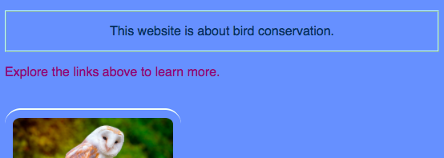
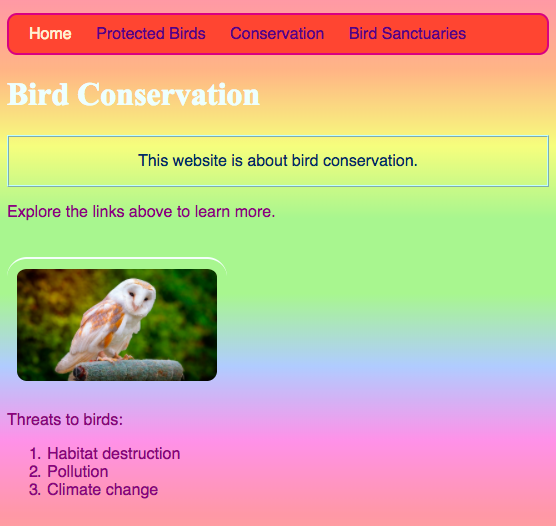
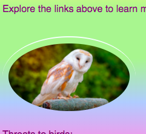

## व्यक्तिगत स्टाइल (style)

 चलो मुख पृष्ठ को थोड़ा सजाएं! दूसरे प्रकार के CSS selector के साथ, आप CSS नियमों का एक अनूठा सेट लागू कर सकते हैं बस **एक विशिष्ट एलीमेंट** के लिए ।

+ `index.html` पर जाएँ और एक पैराग्राफ तत्व ढूंढें(`p`), या यदि आपके पास कोई नहीं है तो एक जोड़ें। टैग के लिए निम्नलिखित **attribute** जोड़ें:

```html
    <p id="myCoolText">
        This website is about bird conservation.
    </p> 
```

`id` यह एक ऐसा नाम है जिसे आप **पहचान** के लिए एक विशेष तत्व को देते हैं। एक पृष्ठ पर कोई दो एलीमेंट्स की कभी भी समान `id` नहीं होनी चाहिए!

+ अब अपनी स्टाइल शीट(style sheet) पर जाएं और निम्न कोड जोड़ें:

```css
    #myCoolText {
        color: #003366;
        border: 2px ridge #ccffff;
        padding: 15px;
        text-align: center;
    }
```

आपका कोड अब कुछ इस प्रकार का दिखना चाहिए:



एक selector के सामने `#` लगा कर आप आपकी वेबसाइट पर एक विशिष्ट एलीमेंट के लिए CSS नियम लागू कर सकते हैं। आप एलीमेंट को उस नाम की मदद से चुनेंगे जिसे आपने एलीमेंट के `id` एट्रिब्यूट को दिया था।

+ चलो मुख पृष्ठ की `body` के लिए एक बनाएं। `index.html` पर जाएँ और `body` टैग में एक `id` जोड़ें।

```html
    <body id="frontPage">
```

+ स्टाइल शीट(style sheet) में, निम्नलिखित CSS नियम जोड़ें:

```css
    #frontPage {
        background: #48D1CC;
        background: linear-gradient(#fea3aa, #f8b88b, #faf884, #baed91, #baed91, #b2cefe, #f2a2e8, #fea3aa);
    }
```

आपको कुछ ऐसा मिलना चाहिए जो इस तरह दिखता है:



आपने अभी **ग्रेडिएंट** का उपयोग किया है! यह नाम उस प्रभाव को दिया गया है जहां एक रंग दूसरे में रंग जाता है। नोट: ग्रेडिएंट से ऊपर की पहली `background` प्रॉपर्टी उन ब्राउज़रों के लिए एक डिफ़ॉल्ट रंग निर्धारित करती है जो ग्रेडिएंट का समर्थन नहीं करते हैं।

यदि आपने कोड पूरी तरह से सही टाइप किया है और आपको ऊपर दिख रहा प्यारा इंद्रधनुष प्रभाव नहीं मिला है, तो हो सकता है कि आपका ब्राउज़र ग्रेडिएंट का समर्थन न करता हो।

आप ग्रेडिएंट के साथ बहुत सारे अलग-अलग प्रभाव बना सकते हैं। यदि आप और अधिक सीखना चाहते हैं, तो [यहाँ](http://dojo.soy/se-html2-gradients){:target="_blank"} पर जाएं।


--- challenge ---

## चुनौती: कुछ और एलीमेंट्स को स्टाइल करें

+ एक और एलीमेंट को` id `देने की कोशिश करें और ऊपरोक्त के अनुसार उस एलीमेंट को `#` के साथ ID selector का उपयोग करके स्टाइल करें। क्या ख्याल है एक तस्वीर बनाने के बारे में जिसमें `border-radius` `100%` है ताकि यह पूरी तरह से गोल हो? वेबसाइट पर कोई भी अन्य चित्र वैसा ही रहेगा जैसा वो है।

--- hints ---


--- hint ---

आप HTML टैग से `id` जोड़कर एक एलीमेंट को `id` एट्रिब्यूट देते हैं, इस प्रकार:

```html
           
```

अपनी पसंद का कोई `id` नाम चुनें।

--- /hint ---

--- hint ---

किसी विशिष्ट एलीमेंट के लिए स्टाइल नियमों को परिभाषित करने के लिए, आप `#` प्रतीक का उपयोग करते हैं, और वह नाम जिसे आपने एलीमेंट को इसके `id` के रूप में दिया था।

```css
  #owly {
    border-radius: 100%;
  }
```

नोट: CSS नियमों के सामने आप जो नाम लिखते हैं, वह **ठीक वही** होना चाहिए जो आपने एलीमेंट के `id` एट्रिब्यूट को दिया था ।

--- /hint ---

--- /hints ---



--- /challenge ---

