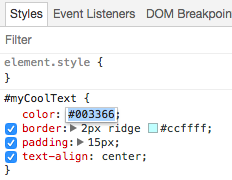
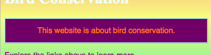

## अन्य वेबसाइटों पर कोड देखें!

**नोट: ** इस चरण को पूरा करने के लिए, आपको इनमें से किसी एक वेब ब्राउज़र का उपयोग करने की आवश्यकता है: Chrome, Firefox, या Internet Explorer/Edge। यदि आपके पास इनमें से कोई भी ब्राउज़र नहीं है, तो आप अगले कार्ड पर जा सकते हैं।

इस कार्ड पर आप सीखेंगे कि ** inspector tool ** का उपयोग करके किसी भी वेबसाइट के कोड की एक झलक कैसे पा सकते हैं, और आपको यह भी पता चलेगा कि कुछ बदलाव कैसे किए जा सकते हैं जो केवल आप देख सकते हैं!

+ शुरू करने से पहले, सुनिश्चित करें कि आपने परियोजना का काम सहेज लिया है। फिर अपने ब्राउज़र में refresh icon पर क्लिक करके अपनी वेबसाइट को रिफ्रेश करें।

+ अपने वेब पृष्ठ पर (वास्तविक पृष्ठ, कोड नहीं) उस टेक्स्ट को हाइलाइट करें जिसे आपने पिछले कार्ड में जोड़ा था, फिर उस पर राइट-क्लिक करें और दिखाई देने वाले मेन्यू से **Inspect** विकल्प का चयन करें। (आपके द्वारा उपयोग किए जा रहे ब्राउज़र के आधार पर विकल्प को 'Inspect Element' या समान कहा जा सकता है। यदि आपको मेन्यू विकल्प खोजने में परेशानी हो रही है, तो बस अपने Dojo में किसी से मदद के लिए पूछें।)


आपके वेब ब्राउज़र में बहुत सारे टैब और कोड के साथ एक नया बॉक्स दिखाई देगा:** developer tools** या संक्षेप में ** dev tools **। यहां आप जिस चीज पर क्लिक करते हैं, उसके लिए कोड और साथ ही पूरे पेज के लिए कोड देख सकते हैं!

### HTML कोड का निरीक्षण

+ उस टैब को देखें जो आपको पृष्ठ के लिए HTML कोड दिखाता है (इसे 'Elements' या 'Inspector' कहा जा सकता है)। कोड ज्यादातर वैसा ही दिखना चाहिए जैसे आपने अपनी HTML फ़ाइल में टाइप किया था! छिपे हुए कोड का विस्तार करने के लिए आप दाईं ओर के छोटे त्रिकोणों पर क्लिक कर सकते हैं।


+ टैग के बीच में टेक्स्ट पर डबल-क्लिक करें। आप अब इसे संपादित करने में सक्षम होने चाहिए! कुछ टाइप करें और <kbd> Enter </kbd>दबाएं।


+ क्या आप अपनी वेबसाइट पर टेक्स्ट अपडेट देख पा रहे हैं? नोट: केवल आप इन परिवर्तनों को देख सकते हैं।


+ अब पेज को **reload** करें और देखो क्या होता है। आपके परिवर्तन गायब हो जाने चाहिए!

+ Dev tools बॉक्स के ऊपरी बाएं कोने में, एक तीर के साथ एक छोटे आयत की तरह दिखने वाले आइकन पर क्लिक करें। अब आप अपने कर्सर को वेब पृष्ठ पर ले जा सकते हैं, और HTML इंस्पेक्टर आपको उसका वर्णन करने वाला कोड दिखाएगा।

 

### CSS कोड का निरीक्षण

+  चलिए अब CSS कोड पर एक नजर डालते हैं। Developer tools में ** Styles ** टैब देखें (इसे 'Style Editor' या समान कहा जा सकता है)। आपको CSS नियमों का एक समूह दिखना चाहिए, जिसमें, ` #myCoolText ` पैराग्राफ के लिए बनाए गए शामिल हैं।


+ `#myCoolText` नियम में, `color` प्रॉपर्टी के बगल में मान पर क्लिक करें। कोई भिन्न मान टाइप करने का प्रयास करें। अपने वेब पृष्ठ पर टेक्स्ट का रंग परिवर्तन देखें!



नोट: आप colour picker tool का उपयोग करके रंग बदलने के लिए रंगीन वर्ग पर भी क्लिक कर सकते हैं।

+ रंग के बाद की जगह में क्लिक करें। एक नई पंक्ति शुरू होती है, जहां आप अधिक CSS टाइप कर सकते हैं। निम्नलिखित टाइप करें और <kbd> Enter </kbd> दबाएं:

```css
  background-color: #660066;
```

आपको पृष्ठ के उस टुकड़े पर पृष्ठभूमि में परिवर्तन दिखना चाहिए।

 

--- collapse ---
---
title: यह कैसे काम करता है?
---

जब आप developer tools का उपयोग करके वेबसाइट कोड बदलते हैं, तो आप **अस्थायी रूप** से यह **आपके ब्राउज़र में ** जैसा दिखता है उसे बदल रहे होते हैं । आप वास्तव में उन फ़ाइलों को नहीं बदल रहे हैं जो वेबसाइट को बनाती हैं।

जब आप पृष्ठ को रीफ्रेश करते हैं, तो आप वेबसाइट को फिर से इसकी फाइलों (इंटरनेट या अपने कंप्यूटर पर) से लोड कर रहे हैं। इसलिए आपके परिवर्तन गायब हो जाते हैं।

अब जब आप यह जान गयें हैं, तो आप अन्य वेबसाइटों पर कोड के साथ कुछ गड़बड़ करके मज़े कर सकते हैं!

--- /collapse ---

+ किसी अन्य वेबसाइट पर कोड को देखने के लिए इन उपकरणों का उपयोग करने का प्रयास करें। आप चाहें तो बदलाव भी कर सकते हैं! याद रखें, केवल आप अपने द्वारा किए गए परिवर्तनों को देख सकते हैं, और जब आप पेज को रीफ्रेश करेंगे तो सब कुछ रीसेट हो जाएगा।
