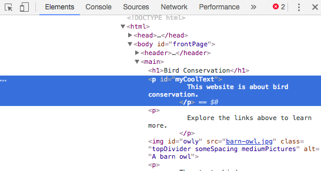
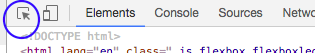

## See the code on other websites!

**Note:** To complete this step, you need use one of these web browsers: Chrome, Firefox, or Internet Explorer/Edge. If you don't have access to one of them, you can just continue on to the next card.

On this card you'll learn how to sneak a peek at the code of any website using the **inspector tool**, and you'll also find out how to make some changes that only you can see!

+ Before you start, make sure your project is saved. Then refresh your website by clicking the refresh icon in your browser.

+ On your web page (the actual page, not the code) highlight the text with the border that you added on the previous card, then right-click on it and select the option **Inspect** from the menu that appears. (The option might be called 'Inspect Element' or similar, depending on what browser you are using. If you're having trouble finding a menu option, just ask someone at your Dojo for help.)


A whole new box will appear in your web browser with lots of tabs and code: the **developer tools**, or **dev tools** for short. Here you can see the code for the thing you clicked on, as well as the code for the whole page!

### Inspecting the HTML code

+ Look for the tab that shows you the HTML code for the page (it might be called 'Elements' or 'Inspector'). The code should look pretty much the same as how you typed it in your HTML file! You can click the little triangles on the right-hand side to expand code that is hidden.



+ Double-click on the text in between the tags. You should be able to edit it now! Type something in and press <kbd>Enter</kbd>.


+ Do you see the text update on your website? Note: only you can see these changes.


+ Now **reload** the page and watch what happens. Your changes should disappear!

+ In the top left-hand corner of the dev tools box, click the icon that looks like a tiny rectangle with an arrow. Now you can move your cursor over the web page, and the HTML inspector will show you the code describing it.

 

### Inspecting the CSS code

+  Let's have a look at the CSS code next. Look for the **Styles** tab in the developer tools (it might be called 'Style Editor' or similar). You should see a bunch of CSS rules, including the ones you created for that paragraph, `#myCoolText`.


+ In the `#myCoolText` rules, click on the value next to the `color` property. Try typing in a different value. Watch the text on your web page change colour straight away!


Note: you can also click the coloured square to change the colour using a colour picker tool.

+ Click in the space after the colour. A new line starts, where you can type more CSS. Type the following and press <kbd>Enter</kbd>:

```css
  background-color: #660066;
```

You should see the background change on that piece of text.

 

--- collapse ---
---
title: How does it work?
---

When you change website code using the developer tools, you are **temporarily** changing what it looks like **in your browser**. You aren't actually changing the files that make up the website.

When you refresh the page, you are loading up the website again from its files (on the internet or on your computer). That's why your changes disappear.

Now that you know that, you can have some fun messing with the code on other websites!

--- /collapse ---

+ Try using these tools to look at the code on another website. You can even make changes if you like! Remember, only you can see the changes you make, and everything will reset when you refresh the page.
